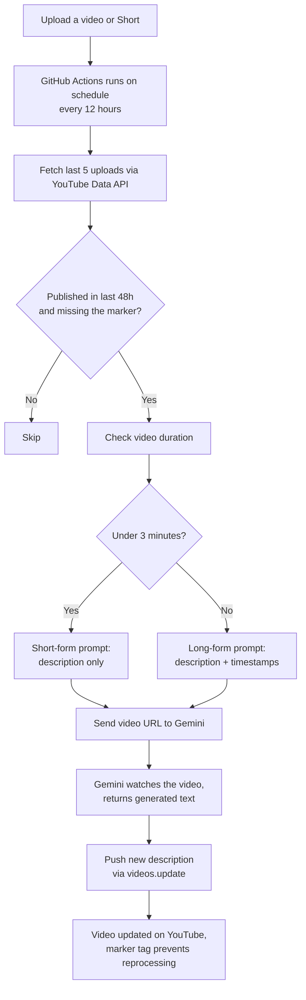

## Introduction
For a while now, every time a video went up, the same annoying dance followed: open YouTube Studio, grab the video link, paste it into Gemini, ask it to write a description and timestamps, wait, copy the output, paste it back into the editor, publish. Every single video. Every single time.

It's not hard. It's just tedious, and tedious things are exactly the kind of thing that quietly stop happening once you're busy or tired or just don't feel like doing five extra steps after already editing and uploading a video. So I decided to just automate the whole thing — especially for small channels where there's no publishing team to soak up that work.

## The actual problem

Good descriptions and timestamps aren't optional if you actually care about a channel growing. They help with discoverability, they make the video easier to navigate, and honestly they just make a channel look more put-together. For a bigger channel with a team and an editor whose whole job is publishing, this isn't a problem. For smaller channels, where it's basically just one person handling everything after the video is shot and edited, it's one more manual step competing for time and attention, and manual steps are where consistency goes to die.

So the real problem wasn't "how do I write a description". Gemini already handled that part fine. The problem was that a good process which depends on someone remembering to do it by hand, every single time, isn't really a process at all.

## What I built

This is just a script gluing together two APIs. But the fact that it's simple doesn't mean it doesn't matter. Small automations like this are underrated exactly because the problem they solve is small and repetitive, but that's precisely the kind of thing that's worth removing from your plate.

Here's roughly how it works:

- A **GitHub Actions workflow** runs on a schedule, every 12 hours, for free, without needing a server running anywhere.
- It checks a channel's most recent uploads through the **YouTube Data API** and looks at which ones don't already have a description with a specific marker in it. That marker is how it knows a video's already been handled, so it never touches the same video twice.
- For anything new, it hands the video's URL straight to **Gemini**, which can watch a public YouTube video directly from its URL.
- It checks the video's duration first. If it's a Short, it gets a short, punchy description with no timestamps, because timestamps on a 40-second video don't make sense. If it's a long-form video, it gets a full description plus a proper timestamped chapter list.
- Once Gemini generates the text, the script pushes it straight back to YouTube through the API, and the video's live description just... updates itself.

That's it. No dashboard, no app, nothing to check in on. You upload, and somewhere in the next 12 hours, the description handles itself.

## How it actually flows

## Conclusion

Nothing in that chain needs anyone to be present. The only human step is the one at the very top (upload the video) and everything after that happens on its own.

I'll say this plainly: there's nothing technically impressive here. It's a couple of API calls stitched together with some basic logic. If you showed this to someone and asked "is this hard," the honest answer is no.

But I don't think impact and difficulty are the same thing. A high-quality description, a proper timestamp breakdown and the right hashtags genuinely affect how discoverable a video is and how professional a channel feels to someone landing on it for the first time. And for a small channel that doesn't have the luxury of a dedicated person handling publishing, doing all of that manually after every single upload gets old fast, and "gets old fast" is usually where good habits quietly fall apart.

What this project actually does is take something that was always worth doing, but easy to skip when you're tired, and puts it on autopilot. A small channel ends up looking more polished and put-together, without anyone having to think about it after they hit upload.

- - -

*If you're interested in learning more about the tool or the code, please reach out at yhbarve[at]uwaterloo.ca.*